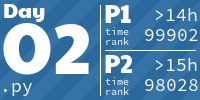
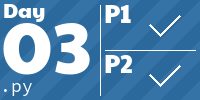
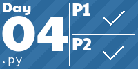
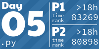
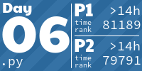
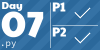
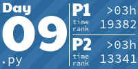
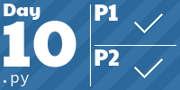
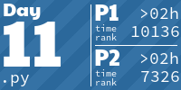
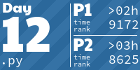

# [ Advent of Code 2022](https://adventofcode.com/2022/)
[](https://github.com/nikku/works-on-my-machine)
[](http://www.apache.org/licenses/LICENSE-2.0.html)

<h2 align="center">
  You can get to any solution just by clicking on a tile below
</h2>
<!-- AOC TILES BEGIN -->
<h1 align="center">
  2022 - 26 ⭐
</h1>
<a href="2022/01/main.py">
  
</a>
<a href="2022/02/main.py">
  
</a>
<a href="2022/03/main.py">
  
</a>
<a href="2022/04/main.py">
  
</a>
<a href="2022/05/main.py">
  
</a>
<a href="2022/06/main.py">
  
</a>
<a href="2022/07/main.py">
  
</a>
<a href="2022/08/main.py">
  
</a>
<a href="2022/09/main.py">
  
</a>
<a href="2022/10/main.py">
  
</a>
<a href="2022/11/main.py">
  
</a>
<a href="2022/12/main.py">
  
</a>
<a href="2022/13/main.py">
  
</a>
<!-- AOC TILES END -->
<h1 align="center">
</h1>

These files are also located in each directory: `input.txt` (my input for the day) and `test.txt` - which is the file from the AoC examples.

All solution print to `stdout`. Example output:
``` python
   >>> print(part1)
   'WCZTHTMPS'
   >>> print(part2)
   'BLSGJSDTS'
```

